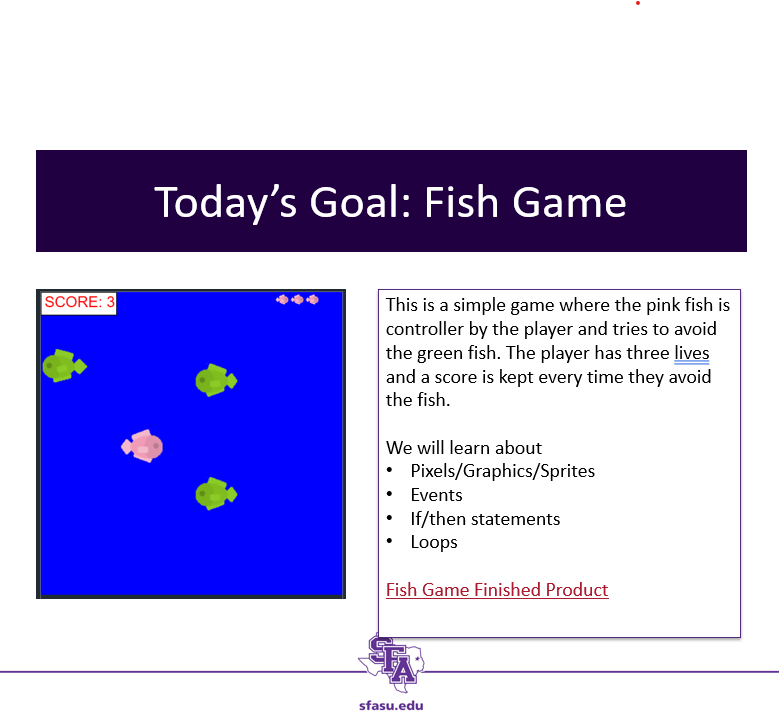

Fish Game

This code.org demonstration has been used to teach high school students how to perform basic coding tasks.

For the finished game sample code, visit [Fish Game on Code.org](https://studio.code.org/projects/gamelab/UIaJx7V1Owte4qK7MVdIn-_S3LiWKrTJwrEbQuWP6UE)

